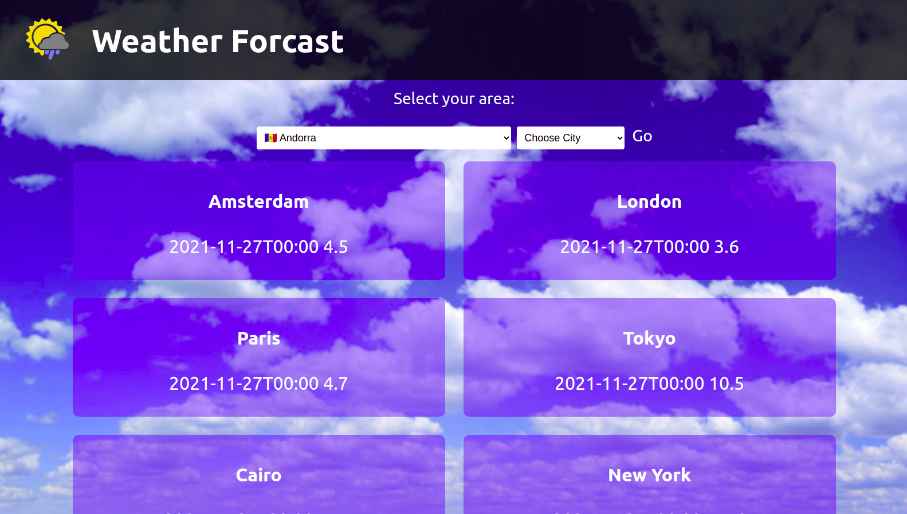
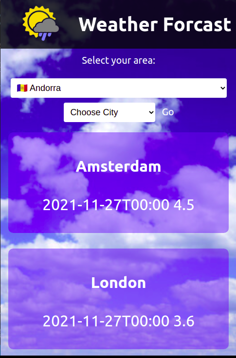

# Weather Forecast

 This web application fetches weather forecast data from https://open-meteo.com/en/docs API for cities displayed on the homepage, the user can also choose specific country and then the city to view cooresponding temperature data.

 ## Live link
 [Link](https://competent-kilby-2b01b5.netlify.app/)

 ## Screenshot

## Presentation video
[video](https://youtu.be/nw5vNCaCKn8)

## Built With

- JavaScript
- React
- Redux
- HTML
- CSS
- Eslint
- Stylelint
- API

## Getting Started

To get a local copy up and running follow these simple example steps.

`git clone https://github.com/Rayan84/weather-forecast.git`

### Installation

- open your terminal
- run `cd weather-forecast`
- run `npm install`
- run `npm start`
- on your browser open http://localhost:3000/

## Authors

👤 **Rayan Rassam**

- GitHub: [@Rayan84](https://github.com/Rayan84)
- Twitter: [@Rayan65096267](https://twitter.com/Rayan65096267)
- LinkedIn: [Rayan Rassam](https://www.linkedin.com/in/rayan-rassam/)

## 🤝 Contributing

Contributions, issues, and feature requests are welcome!

Feel free to check the [issues page](../../issues/).

## Show your support

Give a ⭐️ if you like this project!

## Acknowledgments

- Design guidelines by Nelson Sakwa on Behance.
